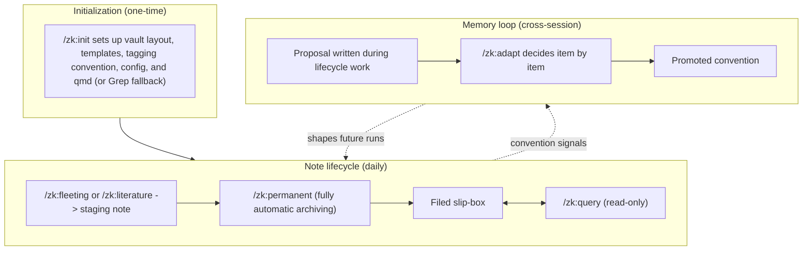
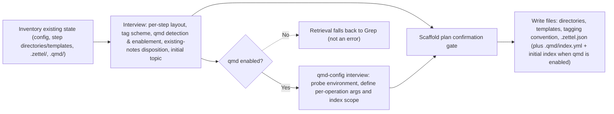
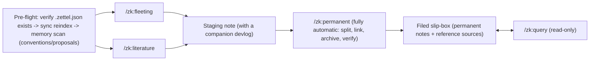
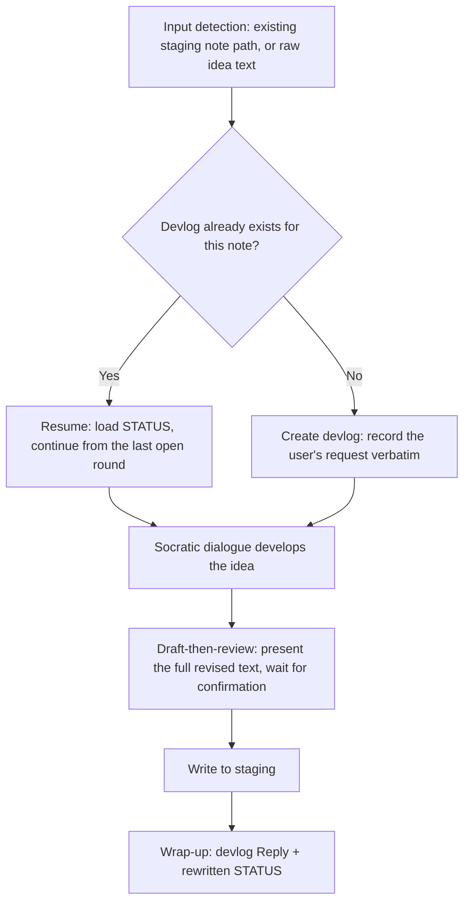
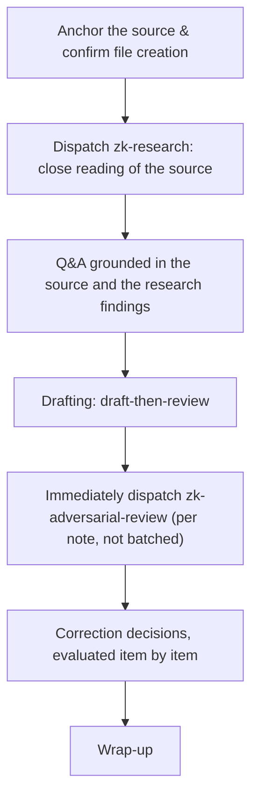
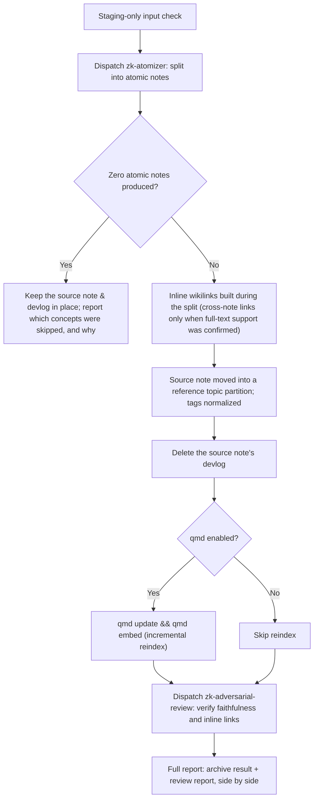
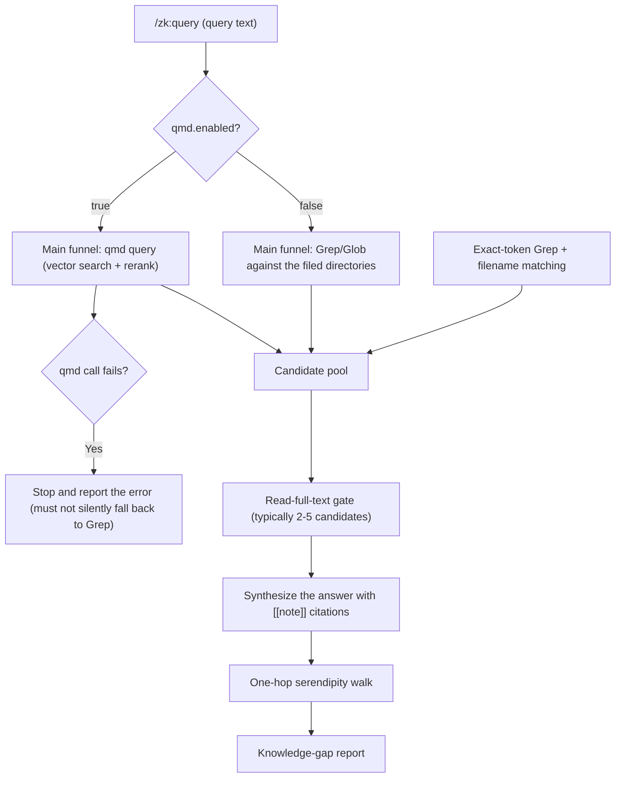
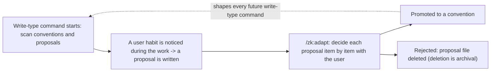

# zk Workflow Diagrams

zk is a Claude Code plugin that generalizes the Zettelkasten method for any Obsidian vault. It provides six commands — `/zk:init`, `/zk:fleeting`, `/zk:literature`, `/zk:permanent`, `/zk:query`, `/zk:adapt` — and three subagents — `zk-research`, `zk-atomizer`, `zk-adversarial-review`. This document walks through the plugin's execution flow, from one-time setup to the daily note lifecycle to the cross-session memory loop, one diagram at a time.

Directory names shown in the diagrams below (e.g. a "staging" or "filed" location) are factory defaults read from the vault's `.zettel.json` config; a vault owner can rename any of them during `/zk:init` without changing the flow described here.

## 1. Overview

The plugin has three moving parts. **Initialization** runs once per vault: `/zk:init` interviews the user and scaffolds everything the other commands depend on. **The note lifecycle** is the daily loop: ideas and sources become staging notes, staging notes are archived into the filed slip-box, and `/zk:query` reads that slip-box back. **The memory loop** runs across sessions: any write-type command can notice a user habit worth remembering, park it as a proposal, and `/zk:adapt` later turns accepted proposals into conventions that quietly shape how future lifecycle commands behave. The sections below zoom into each of these three parts.

## 2. `/zk:init`

`/zk:init` must run at the vault root. It first inventories whatever already exists — an existing config, step directories and templates, `.zettel/`, `.qmd/` — so it knows whether it's doing a fresh setup or filling gaps in a previously initialized vault. The interview then gathers every decision the plugin needs: where each note type lives, how tags are assigned, whether the `qmd` CLI (a retrieval indexer) is installed and should be used, what to do with notes that already exist in the vault (they are left untouched either way), and an optional initial topic partition. If the user enables qmd, a nested qmd-config interview probes the environment and pins down the CLI arguments and index scope for each retrieval operation. Nothing is written to disk yet: every decision funnels into a single scaffold plan that is presented in full and must be confirmed before any directory or file is created. If qmd is not enabled, retrieval simply falls back to Grep for the lifetime of the vault — that is a supported path, not a degraded error state.

## 3. Note Lifecycle Overview

`/zk:fleeting` and `/zk:literature` are the two parallel entry points into the lifecycle — neither has to run before the other. Both begin with the same pre-flight: confirm the vault was initialized (a missing `.zettel.json` stops the command and points the user at `/zk:init`), reindex the retrieval index if qmd is enabled, and scan long-term memory (conventions and proposals) before doing any work. Whichever entry point runs, the result is a staging note with a companion devlog (a working log that lets the command resume if a session is interrupted). `/zk:permanent` later turns a staging note into one or more atomic permanent notes and files the original source note away — fully automatically, with no confirmation prompts. Everything that has been archived lands in the filed slip-box, which `/zk:query` reads from at any time without writing anything back.

## 4. Inside `/zk:fleeting`

`/zk:fleeting` acts as a Socratic thinking partner for a single idea. Its argument is either the path to an existing staging note or raw idea text; a text argument means the note itself doesn't exist yet and will be created once the dialogue converges. Whichever the case, the command loads or creates that note's devlog first — an existing devlog with an unfinished round is resumed from where it left off rather than restarted. The dialogue itself probes the idea by cross-examining its clarity, assumptions, evidence, alternative viewpoints, implications, and significance, picking whichever thread is currently weakest rather than working through a checklist. Once the idea has converged to a clear statement (or a real contradiction has surfaced), the command presents the fully revised note and waits for the user's confirmation — draft-then-review — before writing anything to the staging note and closing out the devlog round.

## 5. Inside `/zk:literature`

Every `/zk:literature` note is anchored to exactly one `source` (a URL or bibliographic reference); a second source is never merged into an existing note, it always gets its own note instead. Creating a brand-new note first passes through a confirmation gate unless the user's intent was already explicit. Once a source is anchored, the `zk-research` subagent is dispatched to do a close, read-only reading of it — if the full source text is unavailable, the subagent aborts rather than substituting secondhand summaries. The user and the assistant then discuss the source through Q&A grounded in that reading, and once the user signals it's time to write, the discussion is drafted into the note body (again through draft-then-review by default). The moment a note is drafted, `/zk:literature` immediately dispatches `zk-adversarial-review` against that specific note — even inside a single invocation that drafts several notes, each one is reviewed as soon as it's written rather than all reviews being saved for the end. The assistant then walks through the review's findings one by one and decides which corrections to apply before wrapping up.

## 6. Inside `/zk:permanent`

`/zk:permanent` only ever accepts a staging note as input — a note already in the filed slip-box can't be re-split. It runs to completion with zero confirmation prompts. The `zk-atomizer` subagent reads the source note in full and autonomously splits it into atomic notes, one concept per note, building cross-note wikilinks as it goes (it only links across notes when it has actually confirmed, by reading the full target text, that the link is warranted). If splitting yields no atomic notes at all — every concept judged too thin to stand on its own — the command stops there: the source note and its devlog are left untouched, and the report simply explains which concepts were skipped and why. Otherwise the command moves the source note into the appropriate topic partition of the reference area, normalizes its tags, and deletes its now-obsolete devlog. If qmd is enabled, this is one of the plugin's two index-maintenance points, so it runs `qmd update` followed by `qmd embed`; if qmd is disabled, reindexing is simply skipped. Finally, `zk-adversarial-review` is dispatched to verify the newly filed notes for faithfulness to the source and to check every inline link, and the wrap-up presents the archiving result and the review report side by side, in full.

## 7. `/zk:query` and Retrieval Routing

`/zk:query` is entirely read-only: it never writes a note, updates an index, or touches a devlog. Retrieval routes on a single runtime signal, `qmd.enabled`: when true, `qmd query` (semantic vector search with reranking) is the main funnel, and a failed qmd call stops the command and reports the error rather than quietly falling back to Grep — enabled means qmd is expected to work, so a failure is a real problem to surface. When qmd is disabled, the main funnel is simply Grep and Glob against the filed directories. Either way, an exact-token Grep pass (catching identifiers and proper nouns that semantic search tends to miss) is always run and merged into the same candidate pool. Before anything is cited, every candidate the answer will actually rely on must be read in full — a similarity score or hit count alone is never enough to justify a citation. The answer itself cites its sources inline, after which the command follows every outbound wikilink from the notes it just read in full that wasn't already in the candidate pool — a one-hop "serendipity walk" that surfaces adjacent notes the retrieval step didn't directly return — and closes with an honest account of what the query couldn't fully answer.

## 8. Memory Loop

Every write-type command (`/zk:fleeting`, `/zk:literature`, `/zk:permanent`, `/zk:adapt` itself) starts by scanning `.zettel/conventions/` and `.zettel/proposals/`: a convention whose trigger condition matches the current work must be read in full and followed, and any relevant open proposal is flagged in the wrap-up report (without ever blocking or changing that run's behavior). When a command notices a recurring user habit worth remembering during its own work, it writes that observation as a proposal rather than adopting it immediately — conventions are never created except through this proposal queue. `/zk:adapt` is a conversational command: it walks through every open proposal with the user, one at a time, and for each one either rejects it (the proposal file is simply deleted — deletion is the archival step, there's no separate archive) or promotes it into a convention file. Once promoted, that convention takes effect starting with the next write-type command's opening scan.
