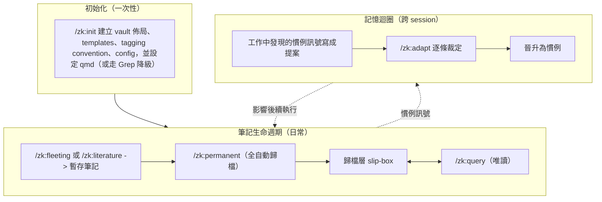
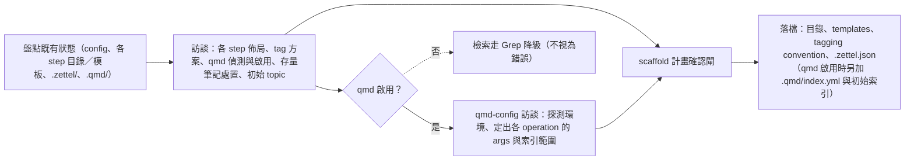
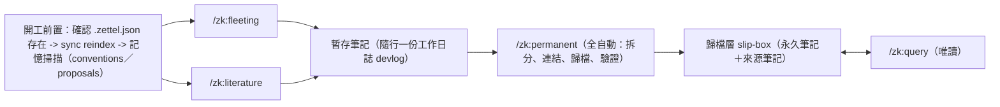
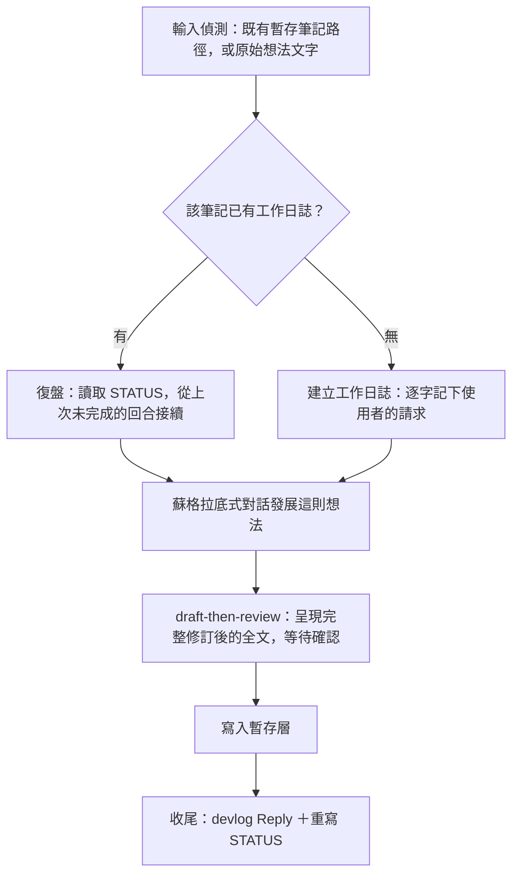
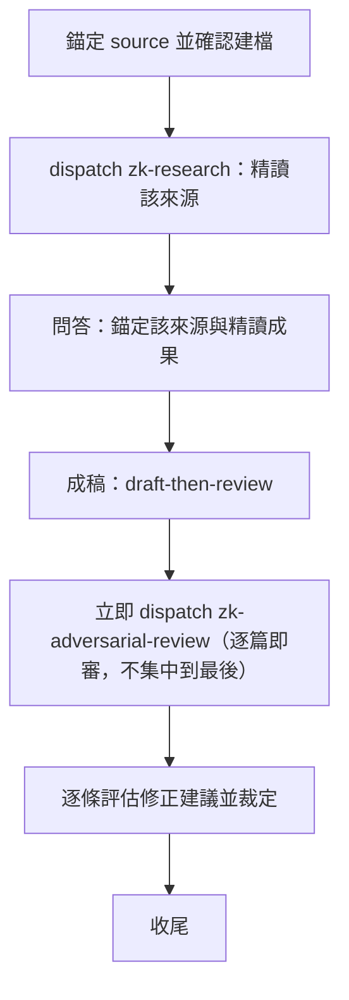
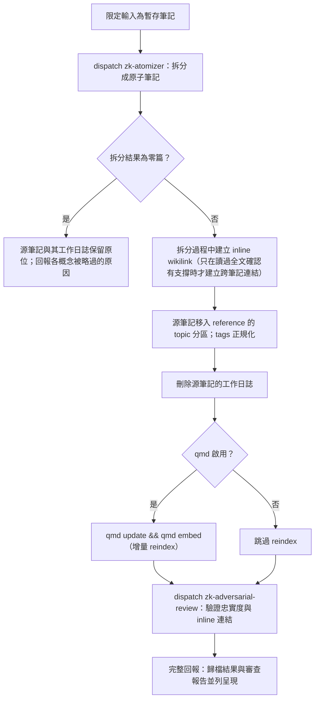
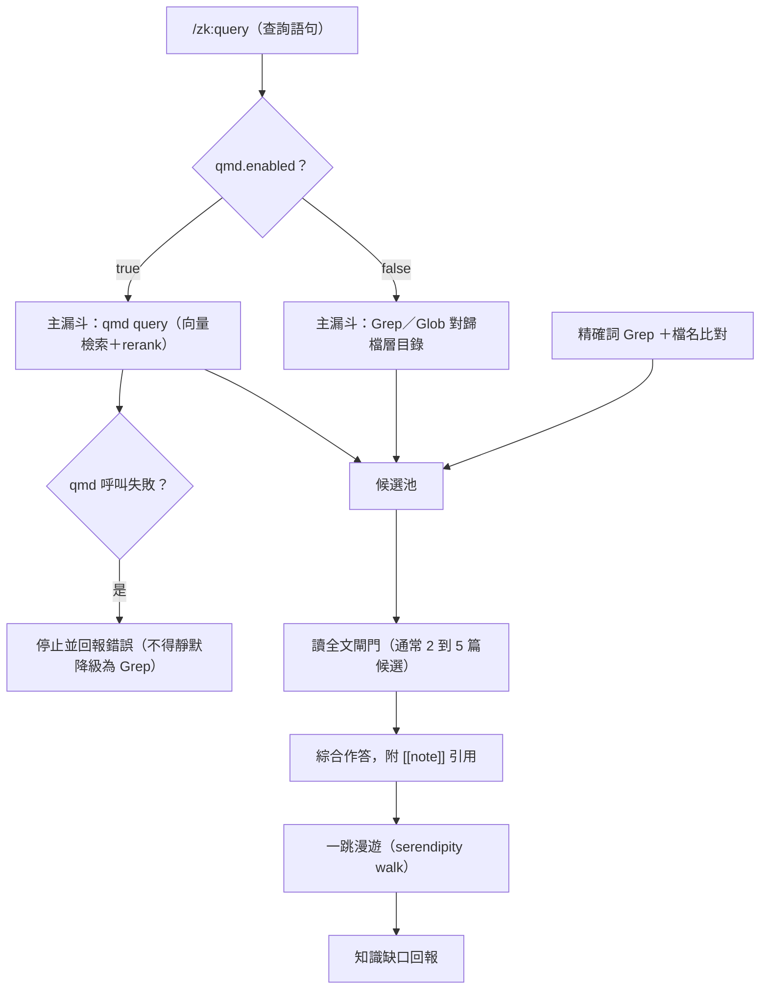
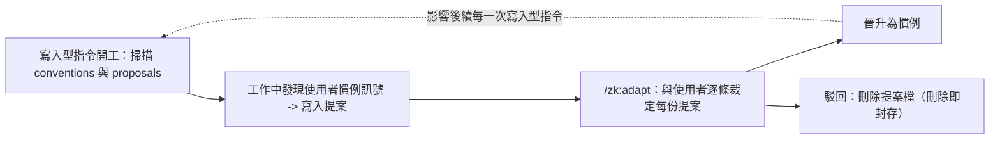

# zk 工作流程圖

zk 是一個 Claude Code plugin，把 Zettelkasten（卡片盒筆記法）方法通用化，讓任何 Obsidian vault 都能使用。它提供六個指令——`/zk:init`、`/zk:fleeting`、`/zk:literature`、`/zk:permanent`、`/zk:query`、`/zk:adapt`——與三個 subagent——`zk-research`、`zk-atomizer`、`zk-adversarial-review`。本文件逐張圖走一遍 plugin 的執行流程：從一次性初始化，到日常的筆記生命週期，再到跨 session 的記憶迴圈。

下方各圖中出現的目錄名稱（例如「暫存層」「歸檔層」所在的位置）皆是從 vault 的 `.zettel.json` config 讀出的出廠預設值；vault 使用者可在 `/zk:init` 訪談中自訂目錄名，不影響本文件描述的流程本身。

## 一、全景

整個 plugin 由三個環節構成。**初始化**只跑一次：`/zk:init` 訪談使用者，把其他指令運作所需的一切都準備好。**筆記生命週期**是日常運作的迴圈：想法與來源先變成暫存層（staging）筆記，暫存筆記歸檔進歸檔層（filed）slip-box，`/zk:query` 隨時從 slip-box 讀取作答。**記憶迴圈**跨 session 運作：任一寫入型指令發現值得記住的使用者習慣時，先把它寫成提案（proposal）擱著，`/zk:adapt` 之後逐條裁定，裁定通過的提案會晉升為慣例（convention），悄悄地影響後續生命週期指令的執行方式。以下各節逐一放大這三個環節。

## 二、`/zk:init`

`/zk:init` 必須在 vault root 執行。它先盤點既有狀態——既有的 config、各 step 目錄與模板、`.zettel/`、`.qmd/`——藉此判斷這是全新初始化還是要在既有 vault 上補缺。接著的訪談逐項取得 plugin 運作所需的每個決策：各筆記類型放在哪裡、tag 怎麼上、`qmd`（一套檢索用的索引工具）是否已安裝並要啟用、vault 裡既有的筆記該怎麼處置（不論答案為何，這些筆記都不會被搬動或改寫）、以及一個可留空的初始 topic 分區。若使用者決定啟用 qmd，會接著進入一段 qmd-config 訪談，探測環境並定出每個檢索操作要用的 CLI 參數與索引範圍。這一切都還沒落到任何檔案上：所有決策最終匯成一份完整的 scaffold 計畫，呈現給使用者確認後才會真正建立目錄或寫入檔案。若使用者不啟用 qmd，之後的檢索就一路走 Grep 降級——這是一個受支援的正常路徑，不是退化或錯誤狀態。

## 三、筆記生命週期全景

`/zk:fleeting` 與 `/zk:literature` 是進入生命週期的兩個平行入口，兩者之間沒有先後順序。兩者都以同一套開工前置起手：先確認 vault 已初始化（`.zettel.json` 不存在就停止，並引導使用者執行 `/zk:init`），qmd 啟用時執行索引 reindex，並在動手做任何事之前先掃描長期記憶（conventions 與 proposals）。無論走哪個入口，結果都是一則帶有隨行工作日誌（devlog——讓指令能在 session 中斷後從斷點復盤接續的工作紀錄）的暫存筆記。之後 `/zk:permanent` 會把暫存筆記拆成一篇或多篇原子（atomic）永久筆記，並把原始的來源筆記歸檔——全程全自動，零確認閘門。一切歸檔完成的筆記都落在歸檔層 slip-box 裡，`/zk:query` 隨時可以從中讀取作答，且不會寫回任何內容。

## 四、`/zk:fleeting` 內部

`/zk:fleeting` 扮演的角色是針對單一想法的蘇格拉底式思考夥伴。它的參數可以是既有暫存筆記的路徑，也可以是一段原始想法文字；若是文字，該筆記其實還不存在，要等對話收斂之後才會建立。無論哪種情況，指令都會先讀取或建立這則筆記的工作日誌——若既有日誌中留有未完成的回合，會從斷點接續，而不是從頭重來。對話本身透過逐條檢視這個想法的具體性、預設假設、支撐證據、其他觀點、推論後果與其重要性來詰問它，每一輪只挑當下最弱的一條線索追問，不機械地照表操課。等這則想法收斂成一句清楚的陳述（或對話中真的浮現矛盾）之後，指令會呈現修訂後的完整筆記全文並等待使用者確認——即 draft-then-review——確認後才寫入暫存筆記，並收尾這一輪的工作日誌回合。

## 五、`/zk:literature` 內部

每一則 `/zk:literature` 筆記恰好錨定一個 `source`（URL 或書目出處）；第二個來源絕不會被併入既有筆記，一律另建一篇獨立的新筆記。建立全新筆記前要先過一道建檔確認閘，除非使用者的意圖已經表達得很明確。source 錨定之後，`zk-research` subagent 會被 dispatch 去對它做一次唯讀的精讀——如果來源全文根本讀不到，這個 subagent 會直接中止，而不會退而求其次改用二手摘要充數。接著使用者與助理透過問答討論這份精讀成果，等使用者發出「可以寫成筆記」的訊號，這段討論就會被綜合寫進筆記本文（同樣預設走 draft-then-review）。筆記一旦成稿，`/zk:literature` 會立即針對那一篇筆記 dispatch `zk-adversarial-review`——即使一次呼叫裡連續成稿好幾篇筆記，也是每篇成稿後立刻審查，不會把全部審查集中留到指令的最後。之後助理逐條檢視審查報告的發現，裁定要套用哪些修正，才進入收尾。

## 六、`/zk:permanent` 內部

`/zk:permanent` 只接受暫存筆記作為輸入——已經在歸檔層 slip-box 裡的筆記無法被重新拆分。它全程零確認閘門，一路自動跑到底。`zk-atomizer` subagent 讀入源筆記全文，全自主拆分成一概念一檔的原子筆記，並在拆分過程中建立跨筆記的 inline wikilink（只有在讀過目標筆記全文、確認真的有支撐時才會建立這類連結）。若拆分結果是零篇原子筆記——每個概念都被判定素材太薄弱、不足以獨立成篇——指令就到此為止：源筆記與其工作日誌原封不動地留在原位，回報只說明哪些概念被略過、為什麼。反之則會把源筆記移入 reference 對應的 topic 分區、正規化其 tags，並刪除這則筆記如今已失去意義的工作日誌。若 qmd 已啟用，這是 plugin 兩個索引維護點之一，會依序執行 `qmd update` 與 `qmd embed`；若未啟用則直接跳過 reindex。最後會 dispatch `zk-adversarial-review` 驗證新歸檔筆記對源筆記的忠實度、逐條檢查 inline 連結，收尾時把歸檔結果與完整的審查報告並列呈現。

## 七、`/zk:query` 與檢索分流

`/zk:query` 全程唯讀：不寫入任何筆記、不更新索引、也不觸碰工作日誌。檢索依一個 runtime 訊號 `qmd.enabled` 分流：啟用時，`qmd query`（帶 rerank 的語意向量檢索）是主漏斗，qmd 呼叫失敗時指令會停止並回報錯誤，而不是靜默降級改用 Grep——啟用即代表 qmd 本該正常運作，失敗是需要被看見、被修的異常。未啟用時，主漏斗就單純是對歸檔層目錄跑 Grep 與 Glob。無論走哪一條，一律另外跑一輪精確詞 Grep（用來補語意檢索對識別碼、專有名詞這類字面 token 的弱點），結果併入同一個候選池。在任何內容被引用之前，作答實際會依賴的每篇候選都必須先讀過全文——單靠相似度分數或命中次數，永遠不足以構成引用的理由。作答本身以 `[[note]]` 標示引用，之後指令會追出剛剛讀過全文的筆記中、行文裡出現卻不在候選池內的全部出鏈——這是一趟「一跳漫遊」，把檢索本身沒直接帶回來但已讀筆記行文指向的鄰近筆記找出來——最後誠實回報這次查詢有哪些地方答不完整。

## 八、記憶迴圈

每個寫入型指令（`/zk:fleeting`、`/zk:literature`、`/zk:permanent`，以及 `/zk:adapt` 自身）開工時都會先掃描 `.zettel/conventions/` 與 `.zettel/proposals/`：觸發條件符合當下工作的慣例必須讀全文並遵循，而任何相關的待議提案會在收尾回報中被提及（但這個提及絕不會因此阻擋或改變這一輪的執行方式）。當某個指令在工作過程中發現值得記住的使用者慣例時，會把這個觀察寫成一份提案，而不是直接採用——慣例的建立永遠只能經過這道提案佇列，沒有跳過佇列的直升路徑。`/zk:adapt` 是一個對話式指令：它逐份把待議提案呈現給使用者一起裁定，每份提案的結果二擇一——駁回（直接刪除提案檔，刪除本身就是封存，不另設 archive）或晉升為一份慣例檔案。一份提案晉升之後，這個慣例就會在下一次任何寫入型指令開工掃描時開始生效。
